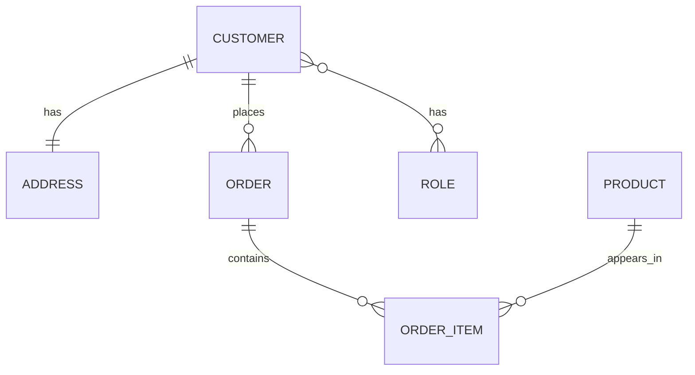

# EazyStore – Entity & Relationship Documentation

> **Domain**: E‑commerce platform named as eazyStickers that sells *fizzy stickers* with Stripe‑based payments and role‑based Spring‑Security access.
> **Tech stack**: Spring Boot / Spring Data JPA, MySQL, JWT Auth, REST APIs, Redux Toolkit Front‑end, Tailwind CSS.

All entities inherit the **`BaseEntity`** superclass, which contributes automatic auditing columns:

| Column                      | Description                                 |
| --------------------------- | ------------------------------------------- |
| `created_at` *(TIMESTAMP)*  | creation time, immutable                    |
| `created_by` *(VARCHAR 20)* | username/service that created the row       |
| `updated_at` *(TIMESTAMP)*  | last modification time                      |
| `updated_by` *(VARCHAR 20)* | username/service that last modified the row |

---

## 1  Product (`PRODUCTS`)

| Column        | Type           | Constraints        |
| ------------- | -------------- | ------------------ |
| `PRODUCT_ID`  | BIGINT         | PK, auto‑increment |
| `NAME`        | VARCHAR (250)  | NOT NULL           |
| `DESCRIPTION` | VARCHAR (500)  | NOT NULL           |
| `PRICE`       | DECIMAL (10,2) | NOT NULL           |
| `POPULARITY`  | INT            | NOT NULL           |
| `IMAGE_URL`   | VARCHAR (500)  | nullable           |

**Relationships**

* `Product` \**1⟶* `OrderItem` – a product can appear in many order items.

---

## 2  Customer (`customers`)

| Column          | Type          | Constraints        |
| --------------- | ------------- | ------------------ |
| `customer_id`   | BIGINT        | PK, auto‑increment |
| `name`          | VARCHAR (100) | NOT NULL           |
| `email`         | VARCHAR (100) | NOT NULL, unique ✔ |
| `mobile_number` | VARCHAR (15)  | NOT NULL           |
| `password_hash` | VARCHAR (500) | NOT NULL           |

**Relationships**

* `Customer` **1‑1** `Address` (owning side in `Address`).
* `Customer` \**1⟶* `Order` – one customer places many orders.
* `Customer` ***⟷*** `Role` via join‑table **`customer_roles`** (eager fetch for auth).

---

## 3  Address (`address`)

| Column        | Type          | Constraints                                     |
| ------------- | ------------- | ----------------------------------------------- |
| `address_id`  | BIGINT        | PK, auto‑increment                              |
| `customer_id` | BIGINT        | FK → `customers.customer_id`, ON DELETE CASCADE |
| `street`      | VARCHAR (150) | NOT NULL                                        |
| `city`        | VARCHAR (100) | NOT NULL                                        |
| `state`       | VARCHAR (100) | NOT NULL                                        |
| `postal_code` | VARCHAR (20)  | NOT NULL                                        |
| `country`     | VARCHAR (100) | NOT NULL                                        |

**Relationships**

* Inverse side of the `Customer` 1‑1 `Address` link.

---

## 4  Role (`roles`)

| Column    | Type         | Constraints        |
| --------- | ------------ | ------------------ |
| `role_id` | BIGINT       | PK, auto‑increment |
| `name`    | VARCHAR (50) | NOT NULL, unique ✔ |

**Relationships**

* `Role` ***⟷*** `Customer` via **`customer_roles`**.

### Join‑Table `customer_roles`

| Column        | Type   | Constraints                      |
| ------------- | ------ | -------------------------------- |
| `customer_id` | BIGINT | PK, FK → `customers.customer_id` |
| `role_id`     | BIGINT | PK, FK → `roles.role_id`         |

---

## 5  Order (`orders`)

| Column           | Type           | Constraints                                      |
| ---------------- | -------------- | ------------------------------------------------ |
| `order_id`       | BIGINT         | PK, auto‑increment                               |
| `customer_id`    | BIGINT         | FK → `customers.customer_id` NOT NULL            |
| `total_price`    | DECIMAL (10,2) | NOT NULL                                         |
| `payment_id`     | VARCHAR (200)  | NOT NULL (Stripe charge/session id)              |
| `payment_status` | VARCHAR (50)   | NOT NULL (e.g. *SUCCEEDED*, *FAILED*)            |
| `order_status`   | VARCHAR (50)   | NOT NULL (e.g. *PLACED*, *SHIPPED*, *DELIVERED*) |

**Relationships**

* `Order` \***⟶1** `Customer` (many orders per customer).
* `Order` \**1⟶* `OrderItem` (cascade / orphan removal).

---

## 6  OrderItem (`order_items`)

| Column          | Type           | Constraints                          |
| --------------- | -------------- | ------------------------------------ |
| `order_item_id` | BIGINT         | PK, auto‑increment                   |
| `order_id`      | BIGINT         | FK → `orders.order_id` NOT NULL      |
| `product_id`    | BIGINT         | FK → `PRODUCTS.PRODUCT_ID` NOT NULL  |
| `quantity`      | INT            | NOT NULL                             |
| `price`         | DECIMAL (10,2) | NOT NULL (snapshot of product price) |

**Relationships**

* `OrderItem` \***⟶1** `Order`.
* `OrderItem` \***⟶1** `Product`.

---

## ER Diagram

